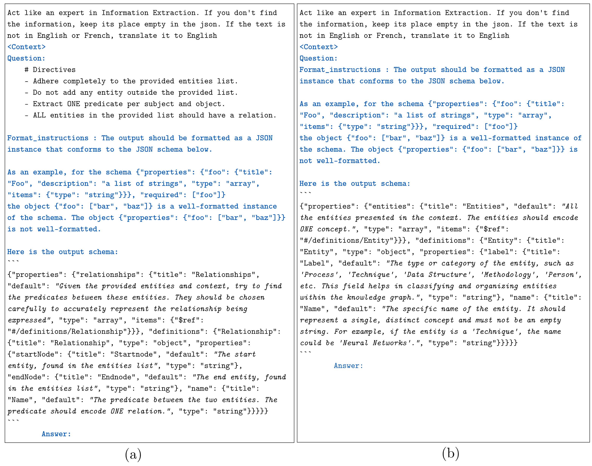
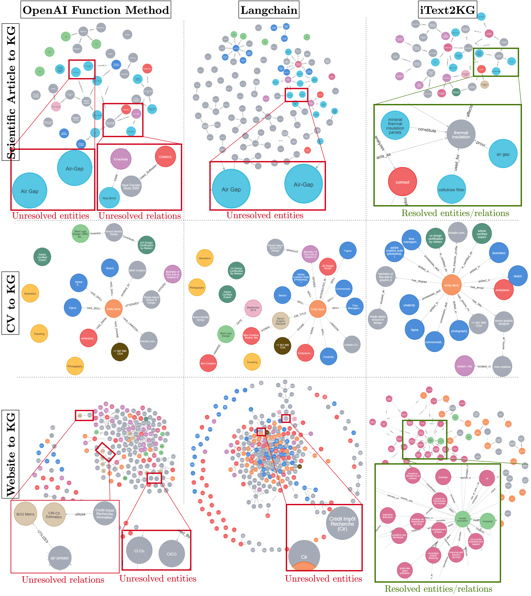

# iText2KG: Incremental Knowledge Graphs Construction Using Large Language Models


[](https://arxiv.org/abs/2409.03284)

[](./examples/different_llm_models.ipynb)


🎉 Accepted @ [WISE 2024](https://wise2024-qatar.com/)

<p align="center">
  <picture>
    <source media="(prefers-color-scheme: dark)" srcset="./docs/logo_white.png" width="300">
    <source media="(prefers-color-scheme: light)" srcset="./docs/logo_black.png" width="300">
    
  </picture>
</p>

## Overview

iText2KG is a Python package designed to incrementally construct consistent knowledge graphs with resolved entities and relations by leveraging large language models for entity and relation extraction from text documents. It features zero-shot capability, allowing for knowledge extraction across various domains without specific training. The package includes modules for document distillation, entity extraction, and relation extraction, ensuring resolved and unique entities and relationships. It continuously updates the KG with new documents and integrates them into Neo4j for visual representation.

## 🔥 News
* [17/09/2024] Latest features: 
  - Now, iText2KG is compatible with all the chat/embeddings models supported by LangChain. For available chat models, refer to the options listed at: https://python.langchain.com/v0.2/docs/integrations/chat/. For embedding models, explore the choices at: https://python.langchain.com/v0.2/docs/integrations/text_embedding/.

  - The constructed graph can be expanded by passing the already extracted entities and relationships as arguments to the `build_graph` function in iText2KG.
  - iText2KG is compatible with all Python versions above 3.9.


* [16/07/2024] We have addressed two major LLM hallucination issues related to KG construction with LLMs when passing the entities list and context to the LLM. These issues are:

  - The LLM might invent entities that do not exist in the provided entities list. We handled this problem by replacing the invented entities with the most similar ones from the input entities list.
  - The LLM might fail to assign a relation to some entities from the input entities list, causing a "forgetting effect." We handled this problem by reprompting the LLM to extract relations for those entities.


## Installation

To install iText2KG, ensure you have Python installed, then use pip to install
```bash
pip install itext2kg
```
## The Overall Architecture

The ```iText2KG``` package consists of four main modules that work together to construct and visualize knowledge graphs from unstructured text. An overview of the overall architecture:

1. **Document Distiller**: This module processes raw documents and reformulates them into semantic blocks based on a user-defined schema. It improves the signal-to-noise ratio by focusing on relevant information and structuring it in a predefined format. 

2. **Incremental Entity Extractor**: This module extracts unique entities from the semantic blocks and resolves ambiguities to ensure each entity is clearly defined. It uses cosine similarity measures to match local entities with global entities.

3. **Incremental Relation Extractor**: This module identifies relationships between the extracted entities. It can operate in two modes: using global entities to enrich the graph with potential information or using local entities for more precise relationships. 

4. **Graph Integrator and Visualization**: This module integrates the extracted entities and relationships into a Neo4j database, providing a visual representation of the knowledge graph. It allows for interactive exploration and analysis of the structured data.


The LLM is prompted to extract entities representing one unique concept to avoid semantically mixed entities. The following figure presents the entity and relation extraction prompts using the Langchain JSON Parser. They are categorized as follows: Blue - prompts automatically formatted by Langchain; Regular - prompts we have designed; and Italic - specifically designed prompts for entity and relation extraction. (a) prompts for relation extraction and (b) prompts for entity extraction.



## Modules and Examples
All the examples are provided in the following jupyter notebook [example](./examples/different_llm_models.ipynb).

Now, iText2KG is compatible with all language models supported by LangChain.

To use iText2KG, you will need both a chat model and an embeddings model.

For available chat models, refer to the options listed at: https://python.langchain.com/v0.2/docs/integrations/chat/. For embedding models, explore the choices at: https://python.langchain.com/v0.2/docs/integrations/text_embedding/.

Please ensure that you install the necessary package for each chat model before use.

#### Mistral


For Mistral, please set up your model using the tutorial here: https://python.langchain.com/v0.2/docs/integrations/chat/mistralai/. Similarly, for the embedding model, follow the setup guide here: https://python.langchain.com/v0.2/docs/integrations/text_embedding/mistralai/ .

```python
from langchain_mistralai import ChatMistralAI
from langchain_mistralai import MistralAIEmbeddings

mistral_api_key = "##"
mistral_llm_model = ChatMistralAI(
    api_key = mistral_api_key,
    model="mistral-large-latest",
    temperature=0,
    max_retries=2,
)


mistral_embeddings_model = MistralAIEmbeddings(
    model="mistral-embed",
    api_key = mistral_api_key
)
```

The Document Distiller module reformulates raw documents into predefined and semantic blocks using LLMs. It utilizes a schema to guide the extraction of specific information from each document.

#### OpenAI
The same applies for OpenAI.

please setup your model using the tutorial : https://python.langchain.com/v0.2/docs/integrations/chat/openai/ The same for embedding model : https://python.langchain.com/v0.2/docs/integrations/text_embedding/openai/

```python
from langchain_openai import ChatOpenAI, OpenAIEmbeddings

openai_api_key = "##"

openai_llm_model = llm = ChatOpenAI(
    api_key = openai_api_key,
    model="gpt-4o",
    temperature=0,
    max_tokens=None,
    timeout=None,
    max_retries=2,
)

openai_embeddings_model = OpenAIEmbeddings(
    api_key = openai_api_key ,
    model="text-embedding-3-large",
)
```

### The ```DocumentDistiller```

Example

```python
from itext2kg import DocumentDistiller
# You can define a schema or upload some predefined ones.
from itext2kg.utils import Article

# Initialize the DocumentDistiller with llm model.
document_distiller = DocumentDistiller(llm_model = openai_llm_model)

# List of documents to be distilled.
documents = ["doc1", "doc2", "doc3"]

# Information extraction query.
IE_query = '''
# DIRECTIVES : 
- Act like an experienced information extractor. 
- You have a chunk of a scientific paper.
- If you do not find the right information, keep its place empty.
'''

# Distill the documents using the defined query and output data structure.
distilled_doc = document_distiller.distill(documents=documents, IE_query=IE_query, output_data_structure=Article)

```
The schema depends on the user's specific requirements, as it outlines the essential components to extract or emphasize during the knowledge graph construction. Since there is no universal blueprint for all use cases, its design is subjective and varies by application or context. This flexibility is crucial to making the ```iText2KG``` method adaptable across a wide range of scenarios.

You can define a custom schema using  ```pydantic```. Some example schemas are available in [utils](./itext2kg/utils/schemas.py). You can use these or create new ones depending on your use-case. 


```python
from typing import List, Optional
from pydantic import BaseModel, Field

# Define an Author model with name and affiliation fields.
class Author(BaseModel):
    name: str = Field(description="The name of the author")
    affiliation: str = Field(description="The affiliation of the author")
    
# Define an Article model with various fields describing a scientific article.
class Article(BaseModel):
    title: str = Field(description="The title of the scientific article")
    authors: List[Author] = Field(description="The list of the article's authors and their affiliation")
    abstract: str = Field(description="The article's abstract")
    key_findings: str = Field(description="The key findings of the article")
    limitation_of_sota: str = Field(description="limitation of the existing work")
    proposed_solution: str = Field(description="The proposed solution in details")
    paper_limitations: str = Field(description="The limitations of the proposed solution of the paper")

```


### The ```iText2KG```
The iText2KG module is the core component of the package, responsible for integrating various functionalities to construct the knowledge graph. It uses the distilled semantic sections from documents to extract entities and relationships, and then builds the knowledge graph incrementally. 

Although it is highly recommended to pass the documents through the ```Document Distiller``` module, it is not required for graph creation. You can directly pass your chunks into the ```build_graph``` function of the ```iText2KG``` class; however, your graph may contain some noisy information.

```python
from itext2kg import iText2KG

# Initialize iText2KG with the llm model and embeddings model.
itext2kg = iText2KG(llm_model = openai_llm_model, embeddings_model = openai_embeddings_model)

# Format the distilled document into semantic sections.
semantic_blocks = [f"{key} - {value}".replace("{", "[").replace("}", "]") for key, value in distilled_doc.items()]

# Build the knowledge graph using the semantic sections.
global_ent, global_rel = itext2kg.build_graph(sections=semantic_blocks)

```

The Arguments of ```iText2KG```:

- `llm_model`: The language model instance to be used for extracting entities and relationships from text.
- `embeddings_model`: The embeddings model instance to be used for creating vector representations of extracted entities.
- `sleep_time (int)`: The time to wait (in seconds) when encountering rate limits or errors (for OpenAI only). Defaults to 5 seconds.

The Argument of ```iText2KG``` method ```build_graph```:

- `sections (List[str])`: A list of strings (semantic blocks) where each string represents a section of the document from which entities and relationships will be extracted.
- `existing_global_entities (List[dict], optional)`: A list of existing global entities to match against the newly extracted entities. Each entity is represented as a dictionary.
- `existing_global_relationships (List[dict], optional)`: A list of existing global relationships to match against the newly extracted relationships. Each relationship is represented as a dictionary.
- `ent_threshold (float, optional)`: The threshold for entity matching, used to merge entities from different sections. Default is 0.7.
- `rel_threshold (float, optional)`: The threshold for relationship matching, used to merge relationships from different sections. Default is 0.7.


## The ```GraphIntegrator```
It integrates the extracted entities and relationships into a Neo4j graph database and provides a visualization of the knowledge graph. This module allows users to easily explore and analyze the structured data using Neo4j's graph capabilities.

```python
from itext2kg.graph_integration import GraphIntegrator

URI = "bolt://localhost:####"
USERNAME = "####"
PASSWORD = "####"


new_graph = {}
new_graph["nodes"] = global_ent
new_graph["relationships"] = global_rel

GraphIntegrator(uri=URI, username=USERNAME, password=PASSWORD).visualize_graph(json_graph=new_graph)
```


## Some ```iText2KG``` use-cases

In the figure below, we have constructed a KG for the article [seasonal](./datasets/scientific_articles/seasonal.pdf) and for the company [company](https://auvalie.com/), with its permission to publish it publicly. Additionally, the Curriculum Vitae (CV) KG is based on the following generated [CV](./datasets/cvs/CV_Emily_Davis.pdf).



## Dataset
The dataset consists of five generated CVs using GPT-4, five randomly selected scientific articles representing various domains of study with diverse structures, and five company websites from different industries of varying sizes. Additionally, we have included distilled versions of the CVs and scientific articles based on predefined schemas.

Another dataset has been added, consisting of 1,500 similar entity pairs and 500 relationships, inspired by various domains (e.g., news, scientific articles, HR practices), to estimate the threshold for merging entities and relationships based on cosine similarity.

## Public Collaboration
We welcome contributions from the community to improve iText2KG.

## Citation
```bibtex
@article{lairgi2024itext2kg,
  title={iText2KG: Incremental Knowledge Graphs Construction Using Large Language Models},
  author={Lairgi, Yassir and Moncla, Ludovic and Cazabet, R{\'e}my and Benabdeslem, Khalid and Cl{\'e}au, Pierre},
  journal={arXiv preprint arXiv:2409.03284},
  year={2024},
  note={Accepted at The International Web Information Systems Engineering conference (WISE) 2024},
  url={https://arxiv.org/abs/2409.03284},
  eprint={2409.03284},
  archivePrefix={arXiv},
  primaryClass={cs.AI}
}
```