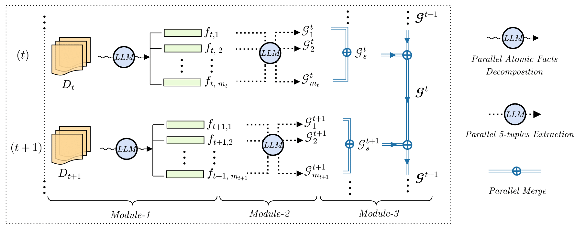
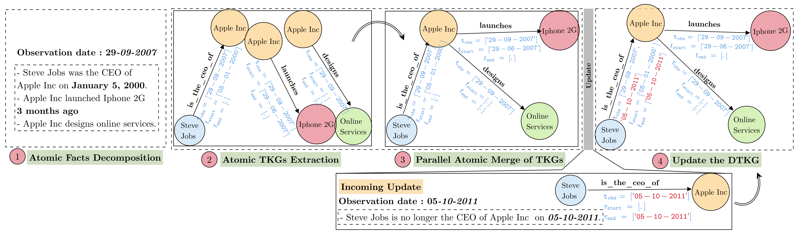
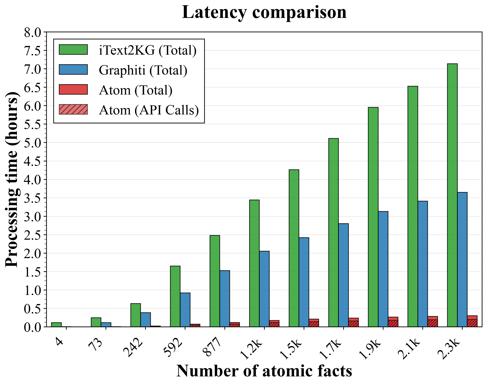

# Construct your knowledge graph (static, temporal, or temporal-dynamic) and detect weak signals

This repository brings together three complementary lines of work from **Yassir Lairgi's PhD**:

1. **[iText2KG](https://arxiv.org/abs/2409.03284)** — *Incremental Knowledge Graphs Construction Using Large Language Models* ([WISE 2024](https://wise2024-qatar.com/))
2. **[ATOM](https://arxiv.org/abs/2510.22590)** — *AdapTive and OptiMized dynamic temporal knowledge graph construction using LLMs* ([Findings of EACL 2026](https://arxiv.org/abs/2510.22590))
3. **[C-Unseen](https://arxiv.org/abs/2608.26870)** — *Weak Signal Detection in Dynamic Temporal Knowledge Graphs via LLM Reasoning* ([WISE 2026](https://arxiv.org/abs/2608.26870))

Legacy iText2KG documentation remains in [README_itext2kg.md](./README_itext2kg.md).

<p align="center">
  
</p>


[](https://arxiv.org/abs/2510.22590)
[](https://arxiv.org/abs/2409.03284)
[](https://arxiv.org/abs/2608.26870)

[](./examples/)


<p align="center">
  <picture>
    <source media="(prefers-color-scheme: dark)" srcset="./docs/logo_atom_white.png" width="220">
    <source media="(prefers-color-scheme: light)" srcset="./docs/logo_atom_black.png" width="220">
    
  </picture>
  &nbsp;&nbsp;&nbsp;
  <picture>
    <source media="(prefers-color-scheme: dark)" srcset="./docs/logo_cunseen_white.png" width="220">
    <source media="(prefers-color-scheme: light)" srcset="./docs/logo_cunseen_black.png" width="220">
    
  </picture>
  &nbsp;&nbsp;&nbsp;
  <picture>
    <source media="(prefers-color-scheme: dark)" srcset="./docs/logo_white.png" width="140">
    <source media="(prefers-color-scheme: light)" srcset="./docs/logo_black.png" width="140">
    
  </picture>
</p>

## 🔥 News

* [04/09/2026] C-Unseen — Weak Signal Detection in DTKGs:
    -   **Paper released**: [C-Unseen: Weak Signal Detection in Dynamic Temporal Knowledge Graphs via LLM Reasoning](https://arxiv.org/abs/2608.26870) (arXiv:2608.26870).
    -   **First definition of weak signals in DTKGs**: a rare, semantically coherent subgraph that proliferates across consecutive TKG snapshots.
    -   **Two-module pipeline**: Rare Subgraphs Extractor (LLM CoT identifies subgraphs in tension with the dominant snapshot narrative) + Weak Signal Alerter (tracks persistence / corroboration across time).
    -   **Self-interpretable**: rare and weak-signal labels are written back onto the DTKG for inspection.
    -   **Outperforms** keyword-, topic-, and graph-based weak-signal baselines.

* [04/09/2026] ATOM — End-to-end scripts & optional domains:
    -   **End-to-end builders**: ready-to-run scripts under [`useful_scripts/`](./useful_scripts/) — [`build_atom_kg_from_json.py`](./useful_scripts/build_atom_kg_from_json.py) (temporal / dynamic KG from dated texts) and [`build_atom_kg_from_pdf.py`](./useful_scripts/build_atom_kg_from_pdf.py) (static KG from a PDF).
    -   **Optional domains on atomic facts**: `extract_atomic_facts` / `build_graph` accept a `domains` list for noise filtering (facts can be labeled and filtered by domain). **Default remains empty** — behavior is unchanged vs. classic ATOM when domains are not provided.

* [20/10/2025] ATOM - Major Enhancements:
    -   **Complete Architectural Redesign**: ATOM now employs a three-module parallel pipeline for DTKG construction and updates.
    -   **Atomic Fact Decomposition**: A new first module splits text into minimal "atomic facts," addressing the "forgetting effect" where LLMs omit facts in longer contexts.
    -   **Enhanced Exhaustivity and Stability**: The new architecture achieves significant gains: ~31% in factual exhaustivity, ~18% in temporal exhaustivity, and ~17% in stability.
    -   **Dual-Time Modeling**: Implemented dual-time modeling (`t_obs` vs. `t_start`/`t_end`) to prevent temporal misattribution in dynamic KGs.
    -   **Parallel 5-Tuple Extraction**: Module-2 now directly extracts 5-tuples `(subject, predicate, object, t_start, t_end)` in parallel from atomic facts.
    -   **Parallel Atomic Merge Architecture**: Module-3 uses an efficient, parallel pairwise merge algorithm, achieving 93.8% latency reduction vs. Graphiti and 95.3% vs. iText2KG.
    -   **LLM-Independent Resolution**: Replaced slow LLM-based resolution with distance metrics (cosine similarity) for scalable, parallel merging.

* [29/07/2025] iText2KG - New Features and Enhanced Capabilities:
    -   **iText2KG_Star**: Introduced a simpler version that directly extracts relationships, eliminating the separate entity extraction step and reducing token consumption.
    -   **Facts-Based KG Construction**: Enhanced the framework with facts-based KG construction using a Document Distiller.
    -   **Dynamic Knowledge Graphs**: Added support for building dynamic KGs that evolve over time. See example: [Dynamic KG Construction](./examples/building_dynamic_kg_openai_posts.ipynb). **NB: Temporal/logical conflicts resolution is not handled in this version.**

* [19/07/2025] iText2KG - Major Performance and Reliability Updates:
    -   **Asynchronous Architecture**: Migrated core methods to `async/await` for non-blocking I/O with LLM APIs.
    -   **Logging System**: Implemented comprehensive logging to replace print statements.
    -   **Enhanced Batch Processing**: Improved efficiency for handling multiple documents and LLM calls.
    -   **Better Error Handling**: Added enhanced error handling and retry mechanisms.

* [07/10/2024] iText2KG - Latest features:
    -   Refactored code with data models for Entity, Relation, and KnowledgeGraph.
    -   Entities are embedded using both name (0.6 weight) and label (0.4 weight) to differentiate concepts (e.g., Python:Language vs. Python:Snake).
    -   Added `max_tries` parameters to `build_graph` to handle LLM hallucinations.

* [17/09/2024] iText2KG - Latest features:
    -   Compatibility with all LangChain chat and embedding models.
    -   The `build_graph` function can now expand existing graphs.
    -   Compatible with Python 3.9+.

* [16/07/2024] iText2KG - Addressed two major LLM hallucination issues:
    -   Handled invented entities by replacing them with the most similar entity from the provided list.
    -   Handled the "forgetting effect" (failing to assign relations) by re-prompting the LLM for missing entities.

---

# ATOM

ATOM is a few-shot and scalable approach for building and continuously updating Temporal Knowledge Graphs (TKGs) from unstructured texts. It can also build static KGs (fix a single observation time) and dynamic temporal KGs (multiple observation times with dual-time modeling).

## Overview

Traditional static KG construction often overlooks the dynamic and time-sensitive nature of real-world data, limiting adaptability to continuous changes. Moreover, recent zero- or few-shot approaches that avoid domain-specific fine-tuning or reliance on prebuilt ontologies often suffer from instability across multiple runs, as well as incomplete coverage of key facts.

ATOM splits input documents into minimal, self-contained “atomic” facts, improving extraction exhaustivity and stability. From these atomic facts, atomic KGs are derived and then merged in parallel.

In a nutshell, ATOM addresses these limitations by:

- ✅ **Improving exhaustivity**: Capturing comprehensive fact coverage from longer texts (~31% gain on factual exhaustivity, ~18% improvement in temporal exhaustivity)
- ✅ **Ensuring stability**: Producing consistent TKGs across multiple runs (~17% improvement)
- ✅ **Enabling scalability**: Supporting large-scale dynamic temporal updates through parallel architecture.

## Architecture

ATOM employs a three-module parallel pipeline that constructs and continuously updates DTKGs from unstructured text.

**Module-1 (Atomic Fact Decomposition)** splits input documents `D_t` observed at time `t` into temporal atomic facts `{f_{t,1}, ..., f_{t,m_t}}` using LLM-based prompting with an optimal chunk size of <400 tokens, where each temporal atomic fact is a short, self-contained snippet that conveys exactly one piece of information.

**Module-2 (Atomic TKGs Construction)** extracts 5-tuples (quintuples) in parallel from each atomic fact `f_{t,i}` to construct atomic temporal KGs `G^t_i`, while embedding nodes and relations and addressing temporal resolution during extraction by transforming end validity facts into affirmative counterparts while modifying only the `t_end` time (e.g., "John Doe is no longer CEO of X on 01-01-2026" → `(John_Doe, is_ceo, X, [.], [01-01-2026])`).

**Module-3 (Parallel Atomic Merge)** employs a binary merge algorithm to merge pairs of atomic TKGs through iterative pairwise merging in parallel until convergence, with three resolution phases: (1) entity resolution using exact match or cosine similarity threshold `θ_E = 0.8`, (2) relation resolution merging relation names regardless of endpoints and timestamps using threshold `θ_R = 0.7`, and (3) temporal resolution that merges observation and validity time sets for relations with similar `(e_s, r_p, e_o)`.

The resulting TKG snapshot `G^t_s` is then merged with the previous DTKG `G^{t-1}` to yield the updated DTKG: `G^t`.

<p align="center">
  
</p>

---

## Example of the ATOM Workflow

On observation date 09-01-2007, ATOM processes the fact "Steve Jobs was the CEO of Apple Inc. on January 9, 2007" to create the 5-tuple `(Steve Jobs, is_ceo, Apple Inc., [09-01-2007], [.])` where `t_start = [09-01-2007]` and `t_end = [.]` (empty/unknown).

Later, on observation date 05-10-2011, ATOM processes the update "Steve Jobs is no longer the CEO of Apple Inc. on 05-10-2011". As described in **Module-2**, this **end validity fact** is transformed into its affirmative counterpart by modifying only the `t_end` time, producing `(Steve Jobs, is_ceo, Apple Inc., [.], [05-10-2011])`.

During Module-3's temporal resolution phase, ATOM detects that both 5-tuples share the same `(e_s, r_p, e_o)` triple and merges their time lists to produce the final 5-tuple: `(Steve Jobs, is_ceo, Apple Inc., [09-01-2007], [05-10-2011])`. This correctly represents that Steve Jobs was CEO from January 9, 2007 to October 5, 2011, while maintaining dual-time modeling with `t_obs = [09-01-2007, 05-10-2011]` to track when each piece of information was observed.

<p align="center">
  
</p>

For more technical details, see:
-   **[`itext2kg/atom/atom.py`](./itext2kg/atom/atom.py)**: Core logic for building, merging, and updating knowledge graphs.

---

## Latency & Scalability

ATOM achieves significant latency reduction (93.8% vs. Graphiti, 95.3% vs. iText2KG) by replacing serial bottlenecks with a fully parallel architecture.

Key architectural advantages include:

1.  **Parallel 5-Tuple Extraction**: ATOM extracts 5-tuples in a single, parallelized step. This avoids the separate entity and relation extraction steps used by iText2KG and Graphiti, which double LLM calls and increase latency.
2.  **LLM-Independent Merging**: The framework uses efficient distance metrics (cosine similarity) for entity/relation resolution. This avoids the computational bottlenecks of LLM-based resolution (used by Graphiti) and allows true parallelization as the graph scales.
3.  **Parallel Atomic Merge**: Atomic TKGs are merged using an iterative pairwise algorithm, which runs in parallel (e.g., 8 threads with a batch size of 40).
4.  **Early Temporal Resolution**: Temporal logic is handled during the extraction phase (Module-2), not during the merge phase.

As a result, the parallel merge process (Module-3) accounts for only 13% of ATOM's total latency. The remainder is attributed to API calls, which can be further minimized by increasing the batch size or scaling local LLM hardware.

<p align="center">
  
</p>

---

## Installation

```bash
pip install --upgrade itext2kg
```

## LLM Compatibility

ATOM is compatible with all language models supported by LangChain. To use ATOM, you will need both a chat model and an embeddings model. For available chat models, refer to the options listed at: https://python.langchain.com/docs/integrations/chat/. For embedding models, explore the choices at: https://python.langchain.com/docs/integrations/text_embedding/

Please ensure that you install the necessary package for each chat model before use.

## ATOM Arguments

**Initialization:**
- `llm_model`: A LangChain chat model instance for extraction
- `embeddings_model`: A LangChain embeddings model instance for entity/relation matching
- `kg_store_dir` (Path | str, optional): If set, each `build_graph` call persists `{obs_timestamp}.json` (+ `.npz` for embeddings); multi-obs merges also write `merged.json` / `merged.npz`

**`extract_atomic_facts` function:**
- `texts` (List[str]): Input texts (chunks / paragraphs) to decompose
- `observation_timestamp` (str): Observation date used to ground relative temporal expressions
- `domains` (List[str], optional): Allowed domain labels. Empty / omitted → no domain classification (`DomainedFact.domain` stays empty). Non-empty → each fact is labeled with one of the allowed domains

**`build_graph` function:**
(This function can also build static KGs: fix a single observation time and pass your atomic facts.)

- `atomic_facts` (List[str]): A list of atomic facts (short, self-contained text snippets) to process
- `obs_timestamp` (str): The observation timestamp when the atomic facts were collected
- `existing_knowledge_graph` (KnowledgeGraph, optional): An existing knowledge graph to merge with the new one
- `domains` (List[str], optional): Per-fact domain labels; if provided, length must match `atomic_facts`. Non-empty domains are written onto relationships
- `ent_threshold` (float, default=0.8): Similarity threshold for entity resolution during merging
- `rel_threshold` (float, default=0.7): Similarity threshold for relationship resolution during merging
- `entity_name_weight` (float, default=0.8): Weight for entity name in similarity calculations
- `entity_label_weight` (float, default=0.2): Weight for entity label in similarity calculations
- `max_workers` (int, default=8): Maximum number of parallel workers for processing

**`build_graph_from_different_obs_times` function:**
- `atomic_facts_with_obs_timestamps` (dict): Keys are observation timestamps (str); values are lists of atomic facts for each timestamp
- `existing_knowledge_graph` (KnowledgeGraph, optional): An existing knowledge graph to merge with the new ones
- `domains_with_obs_timestamps` (dict, optional): Same keys as `atomic_facts_with_obs_timestamps`; values are per-fact domain lists passed through to `build_graph`
- `ent_threshold` (float, default=0.8): Similarity threshold for entity resolution during merging
- `rel_threshold` (float, default=0.7): Similarity threshold for relationship resolution during merging
- `entity_name_weight` (float, default=0.8): Weight for entity name in similarity calculations
- `entity_label_weight` (float, default=0.2): Weight for entity label in similarity calculations
- `max_workers` (int, default=8): Maximum number of parallel workers for processing

## Examples: Building KGs with ATOM

⚠️ **Performance note:** For optimal performance, run ATOM in dedicated Python scripts rather than Jupyter notebooks. ATOM's parallel processing can slow down under notebook event-loop / thread contention.

### Ready-to-run utility scripts

End-to-end builders live under [`useful_scripts/`](./useful_scripts/):

| Script | What it builds |
| --- | --- |
| [`build_atom_kg_from_json.py`](./useful_scripts/build_atom_kg_from_json.py) | Dynamic / temporal KG from a JSON list of dated texts (atomic facts → per-row snapshots → merged KG as JSON + NPZ) |
| [`build_atom_kg_from_pdf.py`](./useful_scripts/build_atom_kg_from_pdf.py) | Static KG from a PDF (PyMuPDF extract → token gate / semantic chunking → atomic facts → one `build_graph` at a single observation time) |

Edit the globals at the top of each script (paths, model names, thresholds, Neo4j toggle), then:

```bash
python useful_scripts/build_atom_kg_from_json.py
python useful_scripts/build_atom_kg_from_pdf.py
```

### Minimal example (dynamic TKG)

The following builds a dynamic TKG from atomic facts of the 2020-COVID-NYT dataset.

```python
import pandas as pd
import asyncio
import ast

from langchain_openai import ChatOpenAI, OpenAIEmbeddings
from itext2kg.atom import Atom
from itext2kg.graph_integration import Neo4jStorage

openai_api_key = "#"
openai_llm_model = ChatOpenAI(
    api_key=openai_api_key,
    model="gpt-4.1-2025-04-14",
    temperature=0,
    max_tokens=None,
    timeout=None,
    max_retries=2,
)

openai_embeddings_model = OpenAIEmbeddings(
    api_key=openai_api_key,
    model="text-embedding-3-large",
)

news_covid = pd.read_pickle("./datasets/atom/nyt_news/2020_nyt_COVID_last_version_ready.pkl")

def to_dictionary(df: pd.DataFrame, max_elements: int | None = 20):
    if isinstance(df["factoids_g_truth"][0], str):
        df["factoids_g_truth"] = df["factoids_g_truth"].apply(lambda x: ast.literal_eval(x))
    grouped_df = df.groupby("date")["factoids_g_truth"].sum().reset_index()[:max_elements]
    return {
        str(date): factoids
        for date, factoids in grouped_df.set_index("date")["factoids_g_truth"].to_dict().items()
    }

news_covid_dict = to_dictionary(news_covid)

atom = Atom(llm_model=openai_llm_model, embeddings_model=openai_embeddings_model)

kg = await atom.build_graph_from_different_obs_times(
    atomic_facts_with_obs_timestamps=news_covid_dict,
)

URI = "bolt://localhost:7687"
USERNAME = "neo4j"
PASSWORD = "##"
Neo4jStorage(uri=URI, username=USERNAME, password=PASSWORD).visualize_graph(knowledge_graph=kg)
```

## Evaluation Scripts, Dataset and Prompts

- **ATOM**: COVID-19 NYT dynamic temporal dataset in [`./datasets/atom`](./datasets/atom) (also on [Hugging Face](https://huggingface.co/datasets/lairgiyassir/2020-COVID-NYT)). Evaluation scripts: [`./evaluation/atom`](./evaluation/atom) (`exhaustivity`, `stability`, `latency`, `merge`, `quintuples_quality`). Prompts: [`./itext2kg/atom/models/`](./itext2kg/atom/models/).
- **C-Unseen**: datasets under [`./datasets/c-unseen`](./datasets/c-unseen); run / ablation / scoring scripts under [`./evaluation/c_unseen`](./evaluation/c_unseen). Prompts: [`./itext2kg/c_unseen/models/`](./itext2kg/c_unseen/models/).

---

# C-Unseen

C-Unseen is a self-interpretable framework for **weak signal detection** in Dynamic Temporal Knowledge Graphs (DTKGs). A weak signal is defined as a rare, semantically coherent subgraph that proliferates across consecutive TKG snapshots.

## Overview

Keyword-, topic-, and untyped-graph methods miss the semantic and relational structure through which weak signals appear. C-Unseen operates on DTKGs (e.g. those built with ATOM) through two modules:

1. **Rare Subgraphs Extractor** — an LLM with chain-of-thought reasoning identifies subgraphs whose content is in tension with the dominant snapshot narrative.
2. **Weak Signal Alerter** — tracks those rare subgraphs across time steps to isolate true weak signals via corroboration.

Experimental results show that C-Unseen outperforms keyword-, topic-, and graph-based baselines. Paper: [arXiv:2608.26870](https://arxiv.org/abs/2608.26870).

## Package entry points

- Core API: [`itext2kg/c_unseen/c_unseen.py`](./itext2kg/c_unseen/c_unseen.py) (`CUnseen.process_snapshot` / `process_snapshots`)
- Rare elements detector & weak-signal alerter under [`itext2kg/c_unseen/`](./itext2kg/c_unseen/)
- Evaluation / run scripts under [`evaluation/c_unseen/`](./evaluation/c_unseen/)

```python
from itext2kg.c_unseen import CUnseen
from itext2kg.c_unseen.models import SignalKnowledgeGraph

c_unseen = CUnseen(llm_model=openai_llm_model, embeddings_model=openai_embeddings_model)

# kg: SignalKnowledgeGraph snapshot; previous_kgs: prior snapshots for corroboration
await c_unseen.process_snapshot(
    kg=kg,
    previous_kgs=previous_kgs,
    snapshot_label="2024-01-16",
    central_entity_name="OpenAI",
)
```

---

## Public Collaboration

We welcome contributions from the community to improve ATOM, C-Unseen, and iText2KG.

## Citation

If you use this work, please cite the relevant paper(s):

```bibtex
@inproceedings{lairgi2024itext2kg,
  title={itext2kg: Incremental knowledge graphs construction using large language models},
  author={Lairgi, Yassir and Moncla, Ludovic and Cazabet, R{\'e}my and Benabdeslem, Khalid and Cl{\'e}au, Pierre},
  booktitle={International Conference on Web Information Systems Engineering},
  pages={214--229},
  year={2024},
  organization={Springer}
}

@inproceedings{lairgi2026atom,
  title={ATOM: AdapTive and OptiMized dynamic temporal knowledge graph construction using LLMs},
  author={Lairgi, Yassir and Moncla, Ludovic and Benabdeslem, Khalid and Cazabet, R{\'e}my and Cl{\'e}au, Pierre},
  booktitle={Findings of the Association for Computational Linguistics: EACL 2026},
  pages={950--966},
  year={2026}
}

@article{lairgi2026c,
  title={C-Unseen: Weak Signal Detection in Dynamic Temporal Knowledge Graphs via LLM Reasoning},
  author={Lairgi, Yassir and Moncla, Ludovic and Benabdeslem, Khalid and Cazabet, R{\'e}my and Cl{\'e}au, Pierre},
  journal={arXiv preprint arXiv:2608.26870},
  year={2026}
}
```
