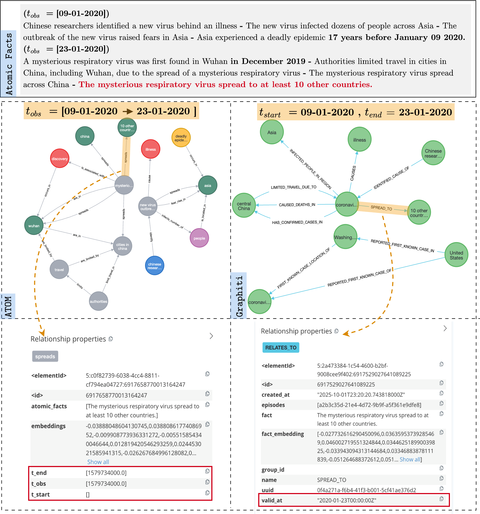

# ATOM: AdapTive and OptiMized Dynamic Temporal Knowledge Graph Construction Using LLMs

[](https://www.python.org/downloads/)

<p align="center">
  <picture>
    <source media="(prefers-color-scheme: dark)" srcset="./docs/logo_atom_white.png" width="300">
    <source media="(prefers-color-scheme: light)" srcset="./docs/logo_atom_black.png" width="300">
    
  </picture>
</p>


A few-shot and scalable approach for building and continuously updating Temporal Knowledge Graphs (TKGs) from unstructured texts.

## Overview

ATOM (AdapTive and OptiMized) addresses key limitations in current zero- and few-shot TKG construction methods by:

- ✅ **Improving exhaustivity**: Capturing comprehensive fact coverage from longer texts (~31% gain on factual exhaustivity)
- ✅ **Ensuring stability**: Producing consistent TKGs across multiple runs (~17% improvement)
- ✅ **Enabling scalability**: Supporting large-scale dynamic temporal updates through parallel architecture (93.8% latency reduction vs. Graphiti)

## Key Features

### Atomic Fact Decomposition
ATOM decomposes unstructured text into **atomic facts** - short, self-contained snippets that convey exactly one piece of information. This addresses the "forgetting effect" where LLMs prioritize salient information in longer contexts while omitting key relationships.

### Dual-Time Modeling
ATOM incorporates dual-time modeling, differentiating between:
- **Observation time** (`t_obs`): When facts are observed
- **Validity period** (`t_start`, `t_end`): Temporal information conveyed by the facts themselves

### Parallel Architecture
The framework employs three modules running in parallel:
1. **Module-1**: Atomic Fact Decomposition
2. **Module-2**: Atomic TKGs Construction (parallel 5-tuple extraction)
3. **Module-3**: Parallel Atomic Merge of TKGs and DTKG Update

## Architecture

ATOM employs a three-module parallel pipeline that constructs and continuously updates Dynamic Temporal Knowledge Graphs (DTKGs) from unstructured text. 

**Module-1 (Atomic Fact Decomposition)** splits input documents `D_t` observed at time `t` into temporal atomic facts `{f_{t,1}, ..., f_{t,m_t}}` using LLM-based prompting with an optimal chunk size of <400 tokens, where each temporal atomic fact is a short, self-contained snippet that conveys exactly one piece of information. 

**Module-2 (Atomic TKGs Construction)** extracts 5-tuples (quintuples) in parallel from each atomic fact `f_{t,i}` to construct atomic temporal KGs `G^t_i = ExtractQuintuplesLLM(f_{t,i}) ⊆ P(E^t × R^t × E^t × T^t_start × T^t_end)`, while embedding nodes and relations and addressing temporal resolution during extraction by transforming end validity facts into affirmative counterparts while modifying only the `t_end` time (e.g., "John Doe is no longer CEO of X on 01-01-2026" → `(John_Doe, is_ceo, X, [.], [01-01-2026])`). 

**Module-3 (Parallel Atomic Merge)** employs a binary merge algorithm to merge pairs of atomic TKGs through iterative pairwise merging in parallel until convergence, with three resolution phases: (1) entity resolution using exact match or cosine similarity threshold `θ_E = 0.8`, (2) relation resolution merging relation names regardless of endpoints and timestamps using threshold `θ_R = 0.7`, and (3) temporal resolution that merges observation and validity time sets for relations with similar `(e_s, r_p, e_o)`. 

The resulting TKG snapshot `G^t_s` is then merged with the previous DTKG `G^{t-1}` using the merge operator ⊕ to yield the updated DTKG: `G^t = G^{t-1} ⊕ G^t_s`. 


<p align="center">
  
</p>

---
## The prompts

### Atomic Facts Decomposition
It is performed using the object `AtomicFact` in `atom/models/schemas.py`

```
You are an expert factoid extraction engine. Your primary function is to read a news paragraph and its associated observation date, and then decompose the text into a comprehensive list of atomic, self-contained, and temporally-grounded facts.

## Task
Given an input paragraph and an `observation_date`, generate a list of all distinctatomic factspresent in the text.

## Guidelines for Generating Temporal Factoids

### 1. Atomic Factoids
- Convert compound or complex sentences into short, single-fact statements
- Each factoid must contain exactly one piece of information or relationship
- Ensure that each factoid is expressed directly and concisely, without redundancies or duplicating the same information across multiple statements
- **Example:** "Unsupervised learning is dedicated to discovering intrinsic patterns in unlabeled datasets" becomes "Unsupervised learning discovers patterns in unlabeled data"

### 2. Decontextualization
- Replace pronouns (e.g., "it," "he," "they") with the full entity name or a clarifying noun phrase
- Include any necessary modifiers so that each factoid is understandable in isolation

### 3. Temporal Context
- Convert ALL time references to absolute dates/times using the observation_date

#### Conversion Rules:
- "today" → exact observation_date
- "yesterday" → observation_date minus 1 day
- "this week" → Monday of observation_date's week
- "last week" → Monday of the week before observation_date
- "this month" → first day of observation_date's month
- "last month" → first day of the month before observation_date
- "this year" → January 1st of observation_date's year
- "last year" → January 1st of the year before observation_date
- Keep explicit dates as-is (e.g., "June 18, 2024")

#### Additional Temporal Guidelines:
- Position time references naturally within factoids
- Split sentences with multiple time references into separate factoids
- **NEVER include relative terms like "today," "yesterday," "last week" in the final factoids**

### 4. Accuracy & Completeness
- Preserve the original meaning without combining multiple facts into a single statement
- Avoid adding details not present in the source text

### 5. End Actions
- If the text indicates the end of a role or an action (for example, someone leaving a position), be explicit about the role/action and the time it ended

### 6. Redundancies
- Eliminate redundancies by simplifying phrases
- **Example:** Convert "the method is crucial for maintaining X" into "the method maintains X"

## Example

**Input:** "On June 18, 2024, Real Madrid won the Champions League final with a 2-1 victory. Following the triumph, fans of Real Madrid celebrated the Champions League victory across the city."

**Output:**
- Real Madrid won the Champions League final on June 18, 2024
- The Champions League final ended with a 2-1 victory for Real Madrid on June 18, 2024
- Fans of Real Madrid celebrated the Champions League victory across the city on June 18, 2024
```
### 5-tuples Extraction
It is performed using the object `RelationshipsExtractor` in `atom/models/schemas.py`
```
Observation Time : {obs_timestamp}

You are a top-tier algorithm designed for extracting information in structured 
formats to build a knowledge graph.
Try to capture as much information from the text as possible without 
sacrificing accuracy. Do not add any information that is not explicitly mentioned in the text
Remember, the knowledge graph should be coherent and easily understandable, 
so maintaining consistency in entity references is crucial.

Few Shot Examples \n

* Michel served as CFO at Acme Corp from 2019 to 2021. He was hired by Beta Inc in 2021, but left that role in 2023.
-> (Michel, is_CFO_of, Acme Corp, ["01-01-2019"], ["01-01-2021"]), (Michel, works_at, Beta Inc, ["01-01-2021"], ["01-01-2023"])

* Subsequent experiments confirmed the role of microRNAs in modulating cell growth.
-> (Experiments, confirm_role_of, microRNAs, [], []), (microRNAs, modulate, Cell Growth, [], [])

* Researchers used high-resolution imaging in a study on neural plasticity.
-> (Researchers, use, High-Resolution Imaging, [], []), (High-Resolution Imaging, is_used_in, Study on Neural Plasticity, [], [])

* Sarah was a board member of GreenFuture until 2019.
-> (Sarah, is_board_member_of, GreenFuture, [], ["01-01-2019"])

* Dr. Lee was the head of the Oncology Department until 2022.
-> (Dr. Lee, is_head_of, Oncology Department, [], ["01-01-2022"])

* Activity-dependent modulation of receptor trafficking is crucial for maintaining synaptic efficacy.
-> (Activity-Dependent Modulation, involves, Receptor Trafficking, [], []), (Receptor Trafficking, maintains, Synaptic Efficacy, [], [])

* (observation_date = 2024-06-15) John Doe is no longer the CEO of GreenIT a few months ago.
-> (John Doe, is_CEO_of, GreenIT, [], ["2024-03-15"])
# "a few months ago" ≈ 3 months → 2024-06-15 minus 3 months = 2024-03-15

* John Doe's marriage is happening on 26-02-2026.
-> (John Doe, has_status, Married, ["2026-02-26"], [])

* (observation_date = 2024-03-20) The AI Summit conference started yesterday and will end tomorrow.
-> (AI Summit, has_status, Started, ["2024-03-19"], ["2024-03-21"])

* The independence day of Morocco is celebrated on January 1st each year since 1956.
-> (Morocco, celebrates, Independence Day, ["1956-01-01"], [])

* (observation_date = 2024-08-10) The product launch event is scheduled for next month.
-> (Product Launch, has_status, Scheduled, ["2024-09-01"], [])
# "next month" = first day of September 2024

```

---
## Example of the ATOM Workflow

 On observation date 09-01-2007, ATOM processes the fact "Steve Jobs was the CEO of Apple Inc. on January 9, 2007" to create the 5-tuple `(Steve Jobs, is_ceo, Apple Inc., [09-01-2007], [.])` where `t_start = [09-01-2007]` and `t_end = [.]` (empty/unknown). Later, on observation date 05-10-2011, when processing the incoming update "Steve Jobs is no longer the CEO of Apple Inc. on 05-10-2011", ATOM's Module-2 transforms this **end validity fact** into its affirmative counterpart while modifying only the `t_end` time, producing `(Steve Jobs, is_ceo, Apple Inc., [.], [05-10-2011])` rather than creating a contradictory relation like `is_no_longer_ceo`. During Module-3's temporal resolution phase, ATOM detects that both 5-tuples share the same `(e_s, r_p, e_o)` triple and merges their time lists to produce the final 5-tuple: `(Steve Jobs, is_ceo, Apple Inc., [09-01-2007], [05-10-2011])`, which correctly represents that Steve Jobs was CEO from January 9, 2007 to October 5, 2011, while maintaining dual-time modeling with `t_obs = [09-01-2007, 05-10-2011]` to track when each piece of information was observed. This preprocessing of end-actions during extraction enables ATOM's LLM-independent merging approach, preventing temporal inconsistencies where separate quintuples describing the same temporal fact would coexist in the TKG.


<p align="center">
  
</p>

For more technical details, check out:
- **`atom/atom.py`**: Core logic for building, merging, and updating the knowledge graphs.
- **`evaluation/`**: Scripts to reconduct the experiments. 

---

## Latency & Scalability

ATOM achieves significant latency reduction of 93.8% compared to Graphiti and 95.3% compared to iText2KG by employing a parallel architecture that addresses computational bottlenecks in traditional approaches. While iText2KG and Graphiti separate entity and relation extraction steps (increasing latency and doubling LLM calls), and use incremental entity/relation resolution that restricts parallel requests (with Graphiti's LLM-based resolution limiting parallelization as the graph scales to millions of nodes), ATOM's architecture facilitates (1) parallel LLM calls for 5-tuple extraction using 8 threads with batch size of 40 atomic facts, (2) parallel merge of atomic TKGs through iterative pairwise merging, (3) LLM-independent merging using distance metrics for entity/relation resolution, and (4) temporal resolution during extraction rather than during merging. Notably, Module-3 (the parallel atomic merge) accounts for only 13% of ATOM's total latency, with the remainder attributed to API calls—which can be further minimized by leveraging the parallel architecture through either increasing the batch size (by upgrading the API tier) or scaling hardware for local LLM deployment

<p align="center">
  
</p>

---

## Results

Empirical evaluations demonstrate that ATOM's atomic fact decomposition improves temporal exhaustivity by ~18% and factual exhaustivity by ~31% compared to direct lead paragraph extraction, with ~31% reduction in factual omission and ~17% improvement in stability across multiple runs, though at the cost of a ~9% increase in hallucination rate due to LLM-inferred atomic facts. The parallel architecture enables 93.8% latency reduction versus Graphiti and 95.3% versus iText2KG, demonstrating ATOM's scalability for large-scale dynamic TKG construction. For DTKG construction, ATOM outperforms Graphiti and iText2KG for entity resolution/relation resolution.
---

## Example

The following figure demonstrates the difference between ATOM's and Graphiti's temporal modeling using COVID-19 news from 09-01-2020 to 23-01-2020. For the fact "The mysterious respiratory virus spread to at least 10 other countries" observed on 23-01-2020, Graphiti treats the observation time as the validity start time (t_start), setting `valid_at = 23-01-2020` and implying the spread occurred on that specific date. In contrast, ATOM's dual-time modeling preserves the observation time (t_obs = 23-01-2020) separately from the validity period, recognizing that the article was published on 23-01-2020 but this does not guarantee the spread occurred at that exact time—the spread could have happened days or weeks earlier. This distinction is essential for temporal reasoning: Graphiti would infer that all events in a news article happened on the publication date, while ATOM correctly models when information was observed versus when events actually occurred. This prevents temporal misattribution in dynamic knowledge graphs.

<p align="center">
  
</p>


## Installation

1. **Clone or Fork** the repository:
   ```bash
   git clone https://github.com/geeekai/atom.git
   cd atom


2. **Install Requirements**

Install all dependencies by running:

```bash
pip install -r requirements.txt
```

3. **(Optional) Set Up a Virtual Environment**
It is recommended to use a virtual environment (e.g., conda, venv) to isolate dependencies.

# Example: Building a Temporal Knowledge Graph (TKG) with ATOM from LLMS History

In this example, we demonstrate how to use ATOM to extractatomic factsfrom a dataset, build a dynamic Temporal Knowledge Graph (TKG) across different observation timestamps, and finally visualize the graph using Neo4j.

The process involves:
1. **Loading Data**: Reading an Excel file containing LLMS history with associated observation dates.
2. **Factoid Extraction**: Using the `LangchainOutputParser` to extractatomic factsfrom the text.
3. **Graph Construction**: Groupingatomic factsby observation date and building a knowledge graph that merges atomic KGs from different timestamps.
4. **Visualization**: Rendering the final graph using the GraphIntegrator module connected to a Neo4j database.

Below is the derived example code:

---

```python
import pandas as pd
import asyncio
import ast

# Import LLM and Embeddings models using LangChain wrappers
from langchain_openai import ChatOpenAI, OpenAIEmbeddings
from atom import Atom, Neo4jStorage

# Set up the OpenAI LLM and embeddings models (replace "##" with your API key)
openai_api_key = "##"
openai_llm_model = ChatOpenAI(
    api_key=openai_api_key,
    model="gpt-4.1-2025-04-14",
    temperature=0,
    max_tokens=None,
    timeout=None,
    max_retries=2,
)

openai_embeddings_model = OpenAIEmbeddings(
    api_key=openai_api_key,
    model="text-embedding-3-large",
)

# Load the 2020-COVID-NYT dataset pickle
news_covid = pd.read_pickle("../datasets/nyt_news/2020_nyt_COVID_last_version_ready.pkl")

# Define a helper function to convert the dataframe'satomic factsinto a dictionary,
# where keys are observation dates and values are the combined list ofatomic factsfor that date.
def to_dictionary(df): 

    if isinstance(df['factoids_g_truth'][0], str):
        df["factoids_g_truth"] = df["factoids_g_truth"].apply(lambda x:ast.literal_eval(x))
    grouped_df = df.groupby("date")["factoids_g_truth"].sum().reset_index()
    return {
        str(date): factoids for date, factoids in grouped_df.set_index("date")["factoids_g_truth"].to_dict().items()
        }

# Convert the dataframe into the required dictionary format
news_covid_dict = to_dictionary(news_covid)

# Initialize the ATOM pipeline with the OpenAI models
atom = Atom(llm_model=openai_llm_model, embeddings_model=openai_embeddings_model)

# Build the knowledge graph across different observation timestamps
kg = await atom.build_graph_from_different_obs_times(
    atomic_facts_with_obs_timestamps=news_covid_dict,
    
)

# Visualize the resulting knowledge graph using Neo4j
URI = "bolt://localhost:7687"
USERNAME = "neo4j"
PASSWORD = "##"
Neo4jStorage(uri=URI, username=USERNAME, password=PASSWORD).visualize_graph(knowledge_graph=kg)
```


# Contributing

We welcome contributions! To help improve ATOM:
	1.	Fork this repository to your GitHub account.
	2.	Create a feature branch with your enhancements or bug fixes.
	3.	Submit a pull request detailing the changes.

Please report any issues via the Issues tab. Community feedback is invaluable!
