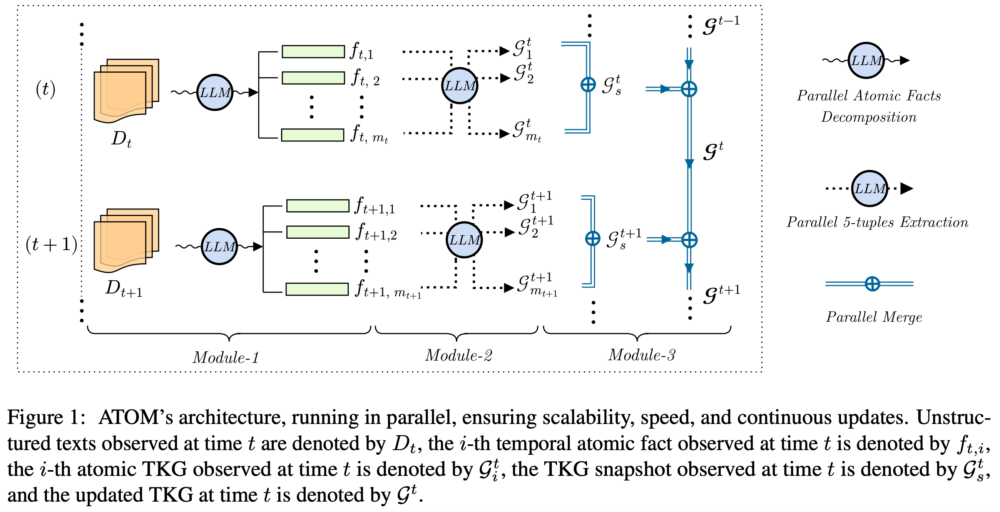

# ATOM: AdapTive and OptiMized Dynamic Temporal Knowledge Graph Construction Using LLMs

iText2KG is now ATOM. ATOM is a few-shot and scalable approach for building and continuously updating Temporal Knowledge Graphs (TKGs) from unstructured texts.
(We kept the legacy iText2KG in the repository, please check the [README](./README_itext2kg.md).)

<p align="center">
  
</p>


[](https://arxiv.org/abs/2510.22590)

[](./examples/)


<p align="center">
  <picture>
    <source media="(prefers-color-scheme: dark)" srcset="./docs/logo_atom_white.png" width="300">
    <source media="(prefers-color-scheme: light)" srcset="./docs/logo_atom_black.png" width="300">
    
  </picture>
</p>

## Overview
Traditional static KG construction often overlooks the dynamic and time-sensitive nature of real-world data, limiting adaptability to continuous changes. Moreover, recent zero- or few-shot approaches that avoid domain-specific fine-tuning or reliance on prebuilt ontologies often suffer from instability across multiple runs, as well as incomplete coverage of key facts.

ATOM splits input documents into minimal, self-contained “atomic” facts, improving extraction exhaustivity and stability. From these atomic facts, atomic KGs are derived and then merged in parallel.

In a nutshell, ATOM addresses these limitations by:

- ✅ **Improving exhaustivity**: Capturing comprehensive fact coverage from longer texts (~31% gain on factual exhaustivity, ~18% improvement in temporal exhaustivity)
- ✅ **Ensuring stability**: Producing consistent TKGs across multiple runs (~17% improvement)
- ✅ **Enabling scalability**: Supporting large-scale dynamic temporal updates through parallel architecture.

## 🔥 News
* [20/10/2025] ATOM - Major Enhancements:
    -   **Complete Architectural Redesign**: ATOM now employs a three-module parallel pipeline for DTKG construction and updates.
    -   **Atomic Fact Decomposition**: A new first module splits text into minimal "atomic facts," addressing the "forgetting effect" where LLMs omit facts in longer contexts.
    -   **Enhanced Exhaustivity and Stability**: The new architecture achieves significant gains: ~31% in factual exhaustivity, ~18% in temporal exhaustivity, and ~17% in stability.
    -   **Dual-Time Modeling**: Implemented dual-time modeling (`t_obs` vs. `t_start`/`t_end`) to prevent temporal misattribution in dynamic KGs.
    -   **Parallel 5-Tuple Extraction**: Module-2 now directly extracts 5-tuples `(subject, predicate, object, t_start, t_end)` in parallel from atomic facts.
    -   **Parallel Atomic Merge Architecture**: Module-3 uses an efficient, parallel pairwise merge algorithm, achieving 93.8% latency reduction vs. Graphiti and 95.3% vs. iText2KG.
    -   **LLM-Independent Resolution**: Replaced slow LLM-based resolution with distance metrics (cosine similarity) for scalable, parallel merging.

* [29/07/2025] iText2KG - New Features and Enhanced Capabilities:
    -   **iText2KG_Star**: Introduced a simpler version that directly extracts relationships, eliminating the separate entity extraction step and reducing token consumption.
    -   **Facts-Based KG Construction**: Enhanced the framework with facts-based KG construction using a Document Distiller.
    -   **Dynamic Knowledge Graphs**: Added support for building dynamic KGs that evolve over time. See example: [Dynamic KG Construction](./examples/building_dynamic_kg_openai_posts.ipynb). **NB: Temporal/logical conflicts resolution is not handled in this version.**

* [19/07/2025] iText2KG - Major Performance and Reliability Updates:
    -   **Asynchronous Architecture**: Migrated core methods to `async/await` for non-blocking I/O with LLM APIs.
    -   **Logging System**: Implemented comprehensive logging to replace print statements.
    -   **Enhanced Batch Processing**: Improved efficiency for handling multiple documents and LLM calls.
    -   **Better Error Handling**: Added enhanced error handling and retry mechanisms.

* [07/10/2024] iText2KG - Latest features:
    -   Refactored code with data models for Entity, Relation, and KnowledgeGraph.
    -   Entities are embedded using both name (0.6 weight) and label (0.4 weight) to differentiate concepts (e.g., Python:Language vs. Python:Snake).
    -   Added `max_tries` parameters to `build_graph` to handle LLM hallucinations.

* [17/09/2024] iText2KG - Latest features:
    -   Compatibility with all LangChain chat and embedding models.
    -   The `build_graph` function can now expand existing graphs.
    -   Compatible with Python 3.9+.

* [16/07/2024] iText2KG - Addressed two major LLM hallucination issues:
    -   Handled invented entities by replacing them with the most similar entity from the provided list.
    -   Handled the "forgetting effect" (failing to assign relations) by re-prompting the LLM for missing entities.

## Architecture

ATOM employs a three-module parallel pipeline that constructs and continuously updates DTKGs from unstructured text.

**Module-1 (Atomic Fact Decomposition)** splits input documents `D_t` observed at time `t` into temporal atomic facts `{f_{t,1}, ..., f_{t,m_t}}` using LLM-based prompting with an optimal chunk size of <400 tokens, where each temporal atomic fact is a short, self-contained snippet that conveys exactly one piece of information.

**Module-2 (Atomic TKGs Construction)** extracts 5-tuples (quintuples) in parallel from each atomic fact `f_{t,i}` to construct atomic temporal KGs `G^t_i`, while embedding nodes and relations and addressing temporal resolution during extraction by transforming end validity facts into affirmative counterparts while modifying only the `t_end` time (e.g., "John Doe is no longer CEO of X on 01-01-2026" → `(John_Doe, is_ceo, X, [.], [01-01-2026])`).

**Module-3 (Parallel Atomic Merge)** employs a binary merge algorithm to merge pairs of atomic TKGs through iterative pairwise merging in parallel until convergence, with three resolution phases: (1) entity resolution using exact match or cosine similarity threshold `θ_E = 0.8`, (2) relation resolution merging relation names regardless of endpoints and timestamps using threshold `θ_R = 0.7`, and (3) temporal resolution that merges observation and validity time sets for relations with similar `(e_s, r_p, e_o)`.

The resulting TKG snapshot `G^t_s` is then merged with the previous DTKG `G^{t-1}` to yield the updated DTKG: `G^t`.

<p align="center">
  
</p>

---
## Example of the ATOM Workflow

On observation date 09-01-2007, ATOM processes the fact "Steve Jobs was the CEO of Apple Inc. on January 9, 2007" to create the 5-tuple `(Steve Jobs, is_ceo, Apple Inc., [09-01-2007], [.])` where `t_start = [09-01-2007]` and `t_end = [.]` (empty/unknown).

Later, on observation date 05-10-2011, ATOM processes the update "Steve Jobs is no longer the CEO of Apple Inc. on 05-10-2011". As described in **Module-2**, this **end validity fact** is transformed into its affirmative counterpart by modifying only the `t_end` time, producing `(Steve Jobs, is_ceo, Apple Inc., [.], [05-10-2011])`.

During Module-3's temporal resolution phase, ATOM detects that both 5-tuples share the same `(e_s, r_p, e_o)` triple and merges their time lists to produce the final 5-tuple: `(Steve Jobs, is_ceo, Apple Inc., [09-01-2007], [05-10-2011])`. This correctly represents that Steve Jobs was CEO from January 9, 2007 to October 5, 2011, while maintaining dual-time modeling with `t_obs = [09-01-2007, 05-10-2011]` to track when each piece of information was observed.

<p align="center">
  
</p>

For more technical details, check out:
-   **`atom/atom.py`**: Core logic for building, merging, and updating the knowledge graphs.

---

## Latency & Scalability

ATOM achieves significant latency reduction (93.8% vs. Graphiti, 95.3% vs. iText2KG) by replacing serial bottlenecks with a fully parallel architecture.

Key architectural advantages include:

1.  **Parallel 5-Tuple Extraction**: ATOM extracts 5-tuples in a single, parallelized step. This avoids the separate entity and relation extraction steps used by iText2KG and Graphiti, which double LLM calls and increase latency.
2.  **LLM-Independent Merging**: The framework uses efficient distance metrics (cosine similarity) for entity/relation resolution. This avoids the computational bottlenecks of LLM-based resolution (used by Graphiti) and allows true parallelization as the graph scales.
3.  **Parallel Atomic Merge**: Atomic TKGs are merged using an iterative pairwise algorithm, which runs in parallel (e.g., 8 threads with a batch size of 40).
4.  **Early Temporal Resolution**: Temporal logic is handled during the extraction phase (Module-2), not during the merge phase.

As a result, the parallel merge process (Module-3) accounts for only 13% of ATOM's total latency. The remainder is attributed to API calls, which can be further minimized by increasing the batch size or scaling local LLM hardware.

<p align="center">
  
</p>

---

## Example: Temporal Modeling (ATOM vs. Graphiti)

The following figure demonstrates the difference between ATOM's and Graphiti's temporal modeling using COVID-19 news from 09-01-2020 to 23-01-2020. For ATOM, timestamps are encoded in UNIX format to eliminate overhead associated with string parsing operations and timezone conversion calculations

For the fact "The mysterious respiratory virus spread to at least 10 other countries" observed on 23-01-2020, **Graphiti** treats the observation time as the validity start time (t_start), setting `valid_at = 23-01-2020` and implying the spread occurred on that specific date.

In contrast, **ATOM's** dual-time modeling preserves the observation time (`t_obs = 23-01-2020`) separately from the validity period. It recognizes that the article was published on 23-01-2020, but this does not guarantee the spread occurred at that exact time—the spread could have happened days or weeks earlier. This distinction is essential for temporal reasoning: Graphiti would infer that all events in a news article happened on the publication date, while ATOM correctly models when information was observed versus when events actually occurred, preventing temporal misattribution.

<p align="center">
  
</p>


The figure below shows the temporal resolution comparison between ATOM and Graphiti. Two atomic facts observed on January 28, 2020, report death counts from January 24 (26 deaths) and January 27 (at least 80 deaths). Left (ATOM): performs temporal resolution by detecting similar relations and extending their validity period history (t_end in the figure). Right (Graphiti): creates separate relations for each atomic fact, resulting in duplication. Moreover, Graphiti misinterprets "By January 24, 2020" and "By January 27, 2020" as validity start times rather than validity end times, leading to temporal misattribution.

<p align="center">
  
</p>


## Installation
```pip install --update itext2kg```

## ATOM

### LLM Compatibility

ATOM is compatible with all language models supported by LangChain. To use ATOM, you will need both a chat model and an embeddings model. For available chat models, refer to the options listed at: https://python.langchain.com/docs/integrations/chat/. For embedding models, explore the choices at: https://python.langchain.com/docs/integrations/text_embedding/

Please ensure that you install the necessary package for each chat model before use.

### ATOM Arguments

**Initialization:**
- `llm_model`: A LangChain chat model instance for extracting relationships from text
- `embeddings_model`: A LangChain embeddings model instance for computing semantic similarities

**`build_graph` function:**
(This function could be used to build static KGs as well, just fix an arbitrary observation time and pass your atomic facts).

- `atomic_facts` (List[str]): A list of atomic facts (short, self-contained text snippets) to process
- `obs_timestamp` (str): The observation timestamp when the atomic facts were collected
- `existing_knowledge_graph` (KnowledgeGraph, optional): An existing knowledge graph to merge with the new one
- `ent_threshold` (float, default=0.8): Similarity threshold for entity resolution during merging
- `rel_threshold` (float, default=0.7): Similarity threshold for relationship resolution during merging
- `entity_name_weight` (float, default=0.8): Weight for entity name in similarity calculations
- `entity_label_weight` (float, default=0.2): Weight for entity label in similarity calculations
- `max_workers` (int, default=8): Maximum number of parallel workers for processing

**`build_graph_from_different_obs_times` function:**
- `atomic_facts_with_obs_timestamps` (dict): A dictionary where keys are observation timestamps (str) and values are lists of atomic facts for each timestamp
- `existing_knowledge_graph` (KnowledgeGraph, optional): An existing knowledge graph to merge with the new ones
- `ent_threshold` (float, default=0.8): Similarity threshold for entity resolution during merging
- `rel_threshold` (float, default=0.7): Similarity threshold for relationship resolution during merging
- `entity_name_weight` (float, default=0.8): Weight for entity name in similarity calculations
- `entity_label_weight` (float, default=0.2): Weight for entity label in similarity calculations
- `max_workers` (int, default=8): Maximum number of parallel workers for processing

# Example: Building a TKG from Text

The following is a basic example, where we demonstrate how to use ATOM to build a dynamic TKG from atomic facts of the 2020-COVID-NYT. 

⚠️ Performance Note: For optimal performance, it is better to run ATOM in dedicated Python scripts rather than Jupyter notebooks, as ATOM's parallel processing architecture can experience significant slowdowns due to event loop conflicts and thread contention in notebook environments.

More complex example are coming soon..

---

```python
import pandas as pd
import asyncio
import ast

# Import LLM and Embeddings models using LangChain wrappers
from langchain_openai import ChatOpenAI, OpenAIEmbeddings
from itext2kg.atom import Atom
from itext2kg import Neo4jStorage

# Set up the OpenAI LLM and embeddings models (replace "##" with your API key)
openai_api_key = "#"
openai_llm_model = ChatOpenAI(
    api_key=openai_api_key,
    model="gpt-4.1-2025-04-14",
    temperature=0,
    max_tokens=None,
    timeout=None,
    max_retries=2,
)

openai_embeddings_model = OpenAIEmbeddings(
    api_key=openai_api_key,
    model="text-embedding-3-large",
)

# Load the 2020-COVID-NYT dataset pickle
news_covid = pd.read_pickle("../datasets/atom/nyt_news/2020_nyt_COVID_last_version_ready.pkl")

# Define a helper function to convert the dataframe's atomic facts into a dictionary,
# where keys are observation dates and values are the combined list of atomic facts for that date.
def to_dictionary(df:pd.DataFrame, max_elements: int | None = 20): 

    if isinstance(df['factoids_g_truth'][0], str):
        df["factoids_g_truth"] = df["factoids_g_truth"].apply(lambda x:ast.literal_eval(x))
    grouped_df = df.groupby("date")["factoids_g_truth"].sum().reset_index()[:max_elements]
    return {
        str(date): factoids for date, factoids in grouped_df.set_index("date")["factoids_g_truth"].to_dict().items()
        }

# Convert the dataframe into the required dictionary format
news_covid_dict = to_dictionary(news_covid)

# Initialize the ATOM pipeline with the OpenAI models
atom = Atom(llm_model=openai_llm_model, embeddings_model=openai_embeddings_model)

# Build the knowledge graph across different observation timestamps
kg = await atom.build_graph_from_different_obs_times(
    atomic_facts_with_obs_timestamps=news_covid_dict,
    
)

# Visualize the resulting knowledge graph using Neo4j
URI = "bolt://localhost:7687"
USERNAME = "neo4j"
PASSWORD = "##"
Neo4jStorage(uri=URI, username=USERNAME, password=PASSWORD).visualize_graph(knowledge_graph=kg)
````

## Evaluation Scripts, Dataset and Prompts
The dynamic temporal dataset of COVID-19 from 2020 is located in the folder ./datasets/atom (is available also on [huggingface](https://huggingface.co/datasets/lairgiyassir/2020-COVID-NYT)). To reproduce the results, the scripts are located in the folder ./evaluation. The prompts are located in the folder ./itext2kg/atom/models/schemas/


## Public Collaboration
We welcome contributions from the community to improve ATOM.

## Citation
```bibtex
@article{lairgi2024atom,
  title={ATOM: AdapTive and OptiMized dynamic temporal knowledge graph construction using LLMs},
  author={Lairgi, Yassir and Moncla, Ludovic and Benabdeslem, Khalid and Cazabet, R{\'e}my and Cl{\'e}au, Pierre},
  journal={arXiv preprint arXiv:2510.22590},
  year={2025},
  url={https://arxiv.org/abs/2510.22590},
  eprint={2510.22590},
  archivePrefix={arXiv},
  primaryClass={cs.AI}
}