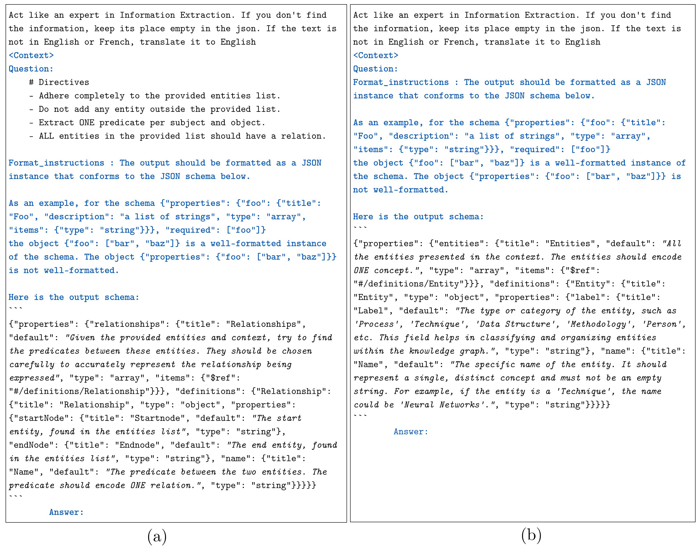

# iText2KG: Incremental Knowledge Graphs Construction Using Large Language Models


[](https://arxiv.org/abs/2409.03284)

[](./examples/)


🎉 Accepted @ [WISE 2024](https://wise2024-qatar.com/)

<p align="center">
  <picture>
    <source media="(prefers-color-scheme: dark)" srcset="./docs/logo_white.png" width="300">
    <source media="(prefers-color-scheme: light)" srcset="./docs/logo_black.png" width="300">
    
  </picture>
</p>

## Overview

iText2KG is a Python package designed to incrementally construct consistent knowledge graphs with resolved entities and relations by leveraging large language models for entity and relation extraction from text documents. It features zero-shot capability, allowing for knowledge extraction across various domains without specific training. The package includes modules for document distillation, entity extraction, and relation extraction, ensuring resolved and unique entities and relationships. It continuously updates the KG with new documents and integrates them into Neo4j for visual representation.

## 🔥 News
* [29/07/2025] New Features and Enhanced Capabilities:
  - **iText2KG_Star**: Introduced a simpler and more efficient version of iText2KG that eliminates the separate entity extraction step. Instead of extracting entities and relations separately, iText2KG_Star directly extracts relationships from text, automatically deriving entities from those relationships. This approach is more efficient as it reduces processing time and token consumption and does not need to handle invented/isolated entities.
  - **Facts-Based KG Construction**: Enhanced the framework with facts-based knowledge graph construction using the Document Distiller to extract structured facts from documents, which are then used for incremental KG building. This approach provides more exhaustive and precise knowledge graphs by focusing on factual information extraction.
  - **Dynamic Knowledge Graphs**: iText2KG now supports building dynamic knowledge graphs that evolve over time. By leveraging the incremental nature of the framework and document snapshots with observation dates, users can track how knowledge changes and grows. See example: [Dynamic KG Construction](./examples/building_dynamic_kg_openai_posts.ipynb). **NB: The temporal/logical conflicts resolution is not handled in this version. But you can apply a post processing filter to resolve them**

* [19/07/2025] Major Performance and Reliability Updates:
  - **Asynchronous Architecture**: Complete migration to async/await patterns for all core methods (`build_graph`, `extract_entities`, `extract_relations`, etc.) enabling better performance and non-blocking I/O operations with LLM APIs.
  - **Logging System**: Implemented comprehensive logging infrastructure to replace all print statements with structured, configurable logging (DEBUG, INFO, WARNING, ERROR levels) with timestamps and module identification.
  - **Enhanced Batch Processing**: Improved efficiency through async batch processing for multiple document handling and LLM API calls.
  - **Better Error Handling**: Enhanced error handling and retry mechanisms with proper logging for production environments.

* [07/10/2024] Latest features:
  - The entire iText2KG code has been refactored by adding data models that describe an Entity, a Relation, and a KnowledgeGraph.
  - Each entity is embedded using both its name and label to avoid merging concepts with similar names but different labels. For example, Python:Language and Python:Snake.
    - The weights for entity name embedding and entity label are configurable, with defaults set to 0.4 for the entity label and 0.6 for the entity name.
  - A max_tries parameter has been added to the iText2KG.build_graph function for entity and relation extraction to prevent hallucinatory effects in structuring the output. Additionally, a max_tries_isolated_entities parameter has been added to the same method to handle hallucinatory effects when processing isolated entities.

* [17/09/2024] Latest features: 
  - Now, iText2KG is compatible with all the chat/embeddings models supported by LangChain. For available chat models, refer to the options listed at: https://python.langchain.com/v0.2/docs/integrations/chat/. For embedding models, explore the choices at: https://python.langchain.com/v0.2/docs/integrations/text_embedding/.

  - The constructed graph can be expanded by passing the already extracted entities and relationships as arguments to the `build_graph` function in iText2KG.
  - iText2KG is compatible with all Python versions above 3.9.


* [16/07/2024] We have addressed two major LLM hallucination issues related to KG construction with LLMs when passing the entities list and context to the LLM. These issues are:

  - The LLM might invent entities that do not exist in the provided entities list. We handled this problem by replacing the invented entities with the most similar ones from the input entities list.
  - The LLM might fail to assign a relation to some entities from the input entities list, causing a "forgetting effect." We handled this problem by reprompting the LLM to extract relations for those entities.


## Installation

To install iText2KG, ensure you have **Python 3.9 or higher** installed (required for async/await functionality), then use pip to install:

```bash
pip install itext2kg
```

## The Overall Architecture

The ```iText2KG``` package consists of four main modules that work together to construct and visualize knowledge graphs from unstructured text. An overview of the overall architecture:

1. **Document Distiller**: This module processes raw documents and reformulates them into semantic blocks based on a user-defined schema. It improves the signal-to-noise ratio by focusing on relevant information and structuring it in a predefined format. 

2. **Incremental Entity Extractor**: This module extracts unique entities from the semantic blocks and resolves ambiguities to ensure each entity is clearly defined. It uses cosine similarity measures to match local entities with global entities.

3. **Incremental Relation Extractor**: This module identifies relationships between the extracted entities. It can operate in two modes: using global entities to enrich the graph with potential information or using local entities for more precise relationships. 

4. **Graph Integrator and Visualization**: This module integrates the extracted entities and relationships into a Neo4j database, providing a visual representation of the knowledge graph. It allows for interactive exploration and analysis of the structured data.


The LLM is prompted to extract entities representing one unique concept to avoid semantically mixed entities. The following figure presents the entity and relation extraction prompts using the Langchain JSON Parser. They are categorized as follows: Blue - prompts automatically formatted by Langchain; Regular - prompts we have designed; and Italic - specifically designed prompts for entity and relation extraction. (a) prompts for relation extraction and (b) prompts for entity extraction.



## Modules and Examples
All the examples are provided in the following jupyter notebooks:
- [Different LLM Models](./examples/different_llm_models.ipynb) - Basic usage with various language models
- [Dynamic Knowledge Graphs](./examples/building_dynamic_kg_openai_posts.ipynb) - Building evolving KGs with temporal context
- Additional examples showcasing facts extraction, iText2KG_Star, and more advanced features

Now, iText2KG is compatible with all language models supported by LangChain.

To use iText2KG, you will need both a chat model and an embeddings model.

For available chat models, refer to the options listed at: https://python.langchain.com/v0.2/docs/integrations/chat/. For embedding models, explore the choices at: https://python.langchain.com/v0.2/docs/integrations/text_embedding/.

Please ensure that you install the necessary package for each chat model before use.

#### Mistral


For Mistral, please set up your model using the tutorial here: https://python.langchain.com/v0.2/docs/integrations/chat/mistralai/. Similarly, for the embedding model, follow the setup guide here: https://python.langchain.com/v0.2/docs/integrations/text_embedding/mistralai/ .

```python
from langchain_mistralai import ChatMistralAI
from langchain_mistralai import MistralAIEmbeddings

mistral_api_key = "##"
mistral_llm_model = ChatMistralAI(
    api_key = mistral_api_key,
    model="mistral-large-latest",
    temperature=0,
    max_retries=2,
)


mistral_embeddings_model = MistralAIEmbeddings(
    model="mistral-embed",
    api_key = mistral_api_key
)
```

The Document Distiller module reformulates raw documents into predefined and semantic blocks using LLMs. It utilizes a schema to guide the extraction of specific information from each document.

#### OpenAI
The same applies for OpenAI.

please setup your model using the tutorial : https://python.langchain.com/v0.2/docs/integrations/chat/openai/ The same for embedding model : https://python.langchain.com/v0.2/docs/integrations/text_embedding/openai/

```python
from langchain_openai import ChatOpenAI, OpenAIEmbeddings

openai_api_key = "##"

openai_llm_model = llm = ChatOpenAI(
    api_key = openai_api_key,
    model="gpt-4o",
    temperature=0,
    max_tokens=None,
    timeout=None,
    max_retries=2,
)

openai_embeddings_model = OpenAIEmbeddings(
    api_key = openai_api_key ,
    model="text-embedding-3-large",
)
```

### The ```DocumentDistiller```

Example

```python
import asyncio
from itext2kg import DocumentDistiller
# You can define a schema or use the predefined ones from schemas.py
from itext2kg.models.schemas import Article

async def main():
    # Initialize the DocumentDistiller with llm model.
    document_distiller = DocumentDistiller(llm_model = openai_llm_model)

    # List of documents to be distilled.
    documents = ["doc1", "doc2", "doc3"]

    # Information extraction query.
    IE_query = '''
    # DIRECTIVES : 
    - Act like an experienced information extractor. 
    - You have a chunk of a scientific paper.
    - If you do not find the right information, keep its place empty.
    '''

    # Distill the documents using the defined query and output data structure.
    # Note: distill() is now async and requires await
    distilled_doc = await document_distiller.distill(documents=documents, IE_query=IE_query, output_data_structure=Article)
    
    return distilled_doc

# Run the async function
distilled_doc = asyncio.run(main())
```
The schema depends on the user's specific requirements, as it outlines the essential components to extract or emphasize during the knowledge graph construction. Since there is no universal blueprint for all use cases, its design is subjective and varies by application or context. This flexibility is crucial to making the ```iText2KG``` method adaptable across a wide range of scenarios.

You can define a custom schema using  ```pydantic```. Some example schemas are available in [models/schemas.py](./itext2kg/models/schemas.py). You can use these or create new ones depending on your use-case. 


```python
from typing import List, Optional
from pydantic import BaseModel, Field

# Define an Author model with name and affiliation fields.
class Author(BaseModel):
    name: str = Field(description="The name of the author")
    affiliation: str = Field(description="The affiliation of the author")
    
# Define an Article model with various fields describing a scientific article.
class Article(BaseModel):
    title: str = Field(description="The title of the scientific article")
    authors: List[Author] = Field(description="The list of the article's authors and their affiliation")
    abstract: str = Field(description="The article's abstract")
    key_findings: str = Field(description="The key findings of the article")
    limitation_of_sota: str = Field(description="limitation of the existing work")
    proposed_solution: str = Field(description="The proposed solution in details")
    paper_limitations: str = Field(description="The limitations of the proposed solution of the paper")

```


### Facts-Based Knowledge Graph Construction

For more exhaustive knowledge graphs, you can use facts-based construction by extracting structured facts from documents first, then using these facts for KG building:

```python
import asyncio
from itext2kg import DocumentDistiller
from itext2kg.models.schemas import Facts

async def extract_facts():
    # Initialize the DocumentDistiller
    document_distiller = DocumentDistiller(llm_model=openai_llm_model)
    
    # Your documents
    documents = ["OpenAI announced ChatGPT agent with new capabilities...", 
                 "The new model can perform complex tasks autonomously..."]
    
    # Extract facts from each document
    IE_query = '''
    # DIRECTIVES : 
    - Act like an experienced information extractor. 
    - Extract clear, factual statements from the text.
    '''
    
    facts_list = await asyncio.gather(*[
        document_distiller.distill(
            documents=[doc], 
            IE_query=IE_query, 
            output_data_structure=Facts
        ) for doc in documents
    ])
    
    return facts_list

# Run the async function
facts = asyncio.run(extract_facts())
```

### The ```iText2KG_Star``` (Recommended)

iText2KG_Star is a simpler and more efficient version that directly extracts relationships from text and automatically derives entities from those relationships, eliminating the separate entity extraction step:

```python
import asyncio
from itext2kg import iText2KG_Star
from itext2kg.logging_config import setup_logging, get_logger

# Optional: Configure logging
setup_logging(level="INFO", log_file="itext2kg.log")
logger = get_logger(__name__)

async def build_knowledge_graph_star():
    # Initialize iText2KG_Star with the llm model and embeddings model
    itext2kg_star = iText2KG_Star(llm_model=openai_llm_model, embeddings_model=openai_embeddings_model)

    # Your text sections (can be facts from document distiller or raw text)
    sections = [
        "OpenAI announced ChatGPT agent with new capabilities for autonomous task execution.",
        "The new model integrates browser tools and terminal access for comprehensive automation.",
        "ChatGPT agent is rolling out to Pro, Plus, and Team users with enhanced safety measures."
    ]

    logger.info("Starting knowledge graph construction with iText2KG_Star...")
    
    # Build the knowledge graph - entities are automatically derived from relationships
    kg = await itext2kg_star.build_graph(
        sections=sections,
        ent_threshold=0.8,      # Higher threshold for more distinct entities
        rel_threshold=0.7,      # Threshold for relationship merging
        observation_date="2025-01-15"  # Optional: add temporal context
    )
    
    logger.info(f"Knowledge graph completed! Entities: {len(kg.entities)}, Relationships: {len(kg.relationships)}")
    return kg

# Run the async function
kg = asyncio.run(build_knowledge_graph_star())
```

### The ```iText2KG```
The iText2KG module is the original component of the package, responsible for integrating various functionalities to construct the knowledge graph. It uses the distilled semantic sections from documents to extract entities and relationships separately, and then builds the knowledge graph incrementally. 

Although it is highly recommended to pass the documents through the ```Document Distiller``` module, it is not required for graph creation. You can directly pass your chunks into the ```build_graph``` function of the ```iText2KG``` class; however, your graph may contain some noisy information.

```python
import asyncio
from itext2kg import iText2KG
from itext2kg.logging_config import setup_logging, get_logger

# Optional: Configure logging
setup_logging(level="INFO", log_file="itext2kg.log")
logger = get_logger(__name__)

async def build_knowledge_graph():
    # Initialize iText2KG with the llm model and embeddings model.
    itext2kg = iText2KG(llm_model = openai_llm_model, embeddings_model = openai_embeddings_model)

    # Format the distilled document into semantic sections.
    semantic_blocks = [f"{key} - {value}".replace("{", "[").replace("}", "]") for key, value in distilled_doc.items()]

    logger.info("Starting knowledge graph construction...")
    
    # Build the knowledge graph using the semantic sections.
    # Note: build_graph() is now async and requires await
    kg = await itext2kg.build_graph(sections=semantic_blocks)
    
    logger.info("Knowledge graph construction completed successfully!")
    return kg

# Run the async function
kg = asyncio.run(build_knowledge_graph())
```

### Arguments

The Arguments of ```iText2KG_Star``` (Recommended):

- `llm_model`: The language model instance to be used for extracting relationships directly from text.
- `embeddings_model`: The embeddings model instance to be used for creating vector representations of entities and relationships.
- `sleep_time (int)`: The time to wait (in seconds) when encountering rate limits or errors. Defaults to 5 seconds.

The Arguments of ```iText2KG_Star``` method ```build_graph```:

- `sections (List[str])`: A list of strings where each string represents a section of the document from which relationships will be extracted and entities derived.
- `existing_knowledge_graph (KnowledgeGraph, optional)`: An existing knowledge graph to merge with. Default is None.
- `ent_threshold (float, optional)`: The threshold for entity matching when merging sections. Default is 0.7.
- `rel_threshold (float, optional)`: The threshold for relationship matching when merging sections. Default is 0.7.
- `max_tries (int, optional)`: The maximum number of attempts to extract relationships. Defaults to 5.
- `entity_name_weight (float)`: The weight of the entity name in matching. Default is 0.6.
- `entity_label_weight (float)`: The weight of the entity label in matching. Default is 0.4.
- `observation_date (str)`: Observation date to add to relationships for temporal tracking. Defaults to "".

The Arguments of ```iText2KG```:

- `llm_model`: The language model instance to be used for extracting entities and relationships from text.
- `embeddings_model`: The embeddings model instance to be used for creating vector representations of extracted entities.
- `sleep_time (int)`: The time to wait (in seconds) when encountering rate limits or errors (for OpenAI only). Defaults to 5 seconds.

The Argument of ```iText2KG``` method ```build_graph```:

- `sections (List[str])`: A list of strings (semantic blocks) where each string represents a section of the document from which entities and relationships will be extracted.
- `ent_threshold (float, optional)`: The threshold for entity matching, used to merge entities from different sections. Default is 0.7.
- `rel_threshold (float, optional)`: The threshold for relationship matching, used to merge relationships from different sections. Default is 0.7.
- `existing_knowledge_graph (KnowledgeGraph, optional)`: An existing knowledge graph to merge the newly extracted entities and relationships into. Default is None.
- `entity_name_weight (float)`: The weight of the entity name in the entity embedding process. Default is 0.6.
- `entity_label_weight (float)`: The weight of the entity label in the entity embedding process. Default is 0.4.
- `max_tries (int, optional)`: The maximum number of attempts to extract entities and relationships. Defaults to 5.
- `max_tries_isolated_entities (int, optional)`: The maximum number of attempts to process isolated entities  (entities without relationships). Defaults to 3.
- `observation_date (str)`: Observation date to add to relationships for temporal tracking. Defaults to "".

### Dynamic Knowledge Graph Construction

Build knowledge graphs that evolve over time by processing documents with temporal context:

```python
import asyncio
from itext2kg import DocumentDistiller, iText2KG_Star
from itext2kg.models.schemas import Facts

async def build_dynamic_knowledge_graph():
    # Initialize components
    document_distiller = DocumentDistiller(llm_model=openai_llm_model)
    itext2kg_star = iText2KG_Star(llm_model=openai_llm_model, embeddings_model=openai_embeddings_model)
    
    # Sample time-series data (e.g., social media posts, news articles, reports)
    time_series_data = [
        {
            "observation_date": "2025-01-15",
            "content": "OpenAI announced ChatGPT agent with autonomous task execution capabilities."
        },
        {
            "observation_date": "2025-01-16", 
            "content": "ChatGPT agent now integrates browser tools and terminal access for enhanced automation."
        },
        {
            "observation_date": "2025-01-17",
            "content": "The new agent is rolling out to Pro, Plus, and Team users with enhanced safety measures."
        }
    ]
    
    # Extract facts from each time point
    IE_query = '''
    # DIRECTIVES : 
    - Act like an experienced information extractor.
    - Extract clear, factual statements from the text.
    '''
    
    # Process first document to initialize the KG
    facts_0 = await document_distiller.distill(
        documents=[time_series_data[0]["content"]], 
        IE_query=IE_query, 
        output_data_structure=Facts
    )
    
    # Build initial knowledge graph
    kg = await itext2kg_star.build_graph(
        sections=facts_0.facts,
        observation_date=time_series_data[0]["observation_date"],
        ent_threshold=0.8,
        rel_threshold=0.7
    )
    
    # Incrementally update with subsequent documents
    for i in range(1, len(time_series_data)):
        print(f"Processing document {i+1} from {time_series_data[i]['observation_date']}")
        
        # Extract facts from current document
        facts = await document_distiller.distill(
            documents=[time_series_data[i]["content"]], 
            IE_query=IE_query, 
            output_data_structure=Facts
        )
        
        # Update the knowledge graph incrementally
        kg = await itext2kg_star.build_graph(
            sections=facts.facts,
            observation_date=time_series_data[i]["observation_date"],
            existing_knowledge_graph=kg.model_copy(),  # Pass existing KG for incremental updates
            ent_threshold=0.8,
            rel_threshold=0.7
        )
    
    print(f"Dynamic KG completed! Entities: {len(kg.entities)}, Relationships: {len(kg.relationships)}")
    
    # Each relationship now contains observation_dates showing when it was first observed
    for rel in kg.relationships:
        if rel.properties.observation_dates:
            print(f"Relationship '{rel.name}' first observed: {rel.properties.observation_dates[0]}")
    
    return kg

# Run the dynamic KG construction
dynamic_kg = asyncio.run(build_dynamic_knowledge_graph())
```

For a complete example of dynamic KG construction from social media posts, see: [Dynamic KG Construction Example](./examples/building_dynamic_kg_openai_posts.ipynb)

## The ```GraphIntegrator```
It integrates the extracted entities and relationships into a Neo4j graph database and provides a visualization of the knowledge graph. This module allows users to easily explore and analyze the structured data using Neo4j's graph capabilities.

```python
from itext2kg.graph_integration import Neo4jStorage

URI = "bolt://localhost:7687"
USERNAME = "neo4j"
PASSWORD = "###"

# Note: Graph visualization remains synchronous
graph_integrator = Neo4jStorage(uri=URI, username=USERNAME, password=PASSWORD)
graph_integrator.visualize_graph(knowledge_graph=kg)
```


## Some ```iText2KG``` use-cases

In the figure below, we have constructed a KG for the article [seasonal](./datasets/scientific_articles/seasonal.pdf) and for the company [company](https://auvalie.com/), with its permission to publish it publicly. Additionally, the Curriculum Vitae (CV) KG is based on the following generated [CV](./datasets/cvs/CV_Emily_Davis.pdf).


## Dataset
The dataset consists of five generated CVs using GPT-4, five randomly selected scientific articles representing various domains of study with diverse structures, and five company websites from different industries of varying sizes. Additionally, we have included distilled versions of the CVs and scientific articles based on predefined schemas.

Another dataset has been added, consisting of 1,500 similar entity pairs and 500 relationships, inspired by various domains (e.g., news, scientific articles, HR practices), to estimate the threshold for merging entities and relationships based on cosine similarity.

## Public Collaboration
We welcome contributions from the community to improve iText2KG.

## Citation
```bibtex
@article{lairgi2024itext2kg,
  title={iText2KG: Incremental Knowledge Graphs Construction Using Large Language Models},
  author={Lairgi, Yassir and Moncla, Ludovic and Cazabet, R{\'e}my and Benabdeslem, Khalid and Cl{\'e}au, Pierre},
  journal={arXiv preprint arXiv:2409.03284},
  year={2024},
  note={Accepted at The International Web Information Systems Engineering conference (WISE) 2024},
  url={https://arxiv.org/abs/2409.03284},
  eprint={2409.03284},
  archivePrefix={arXiv},
  primaryClass={cs.AI}
}
```
